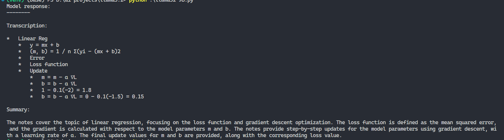
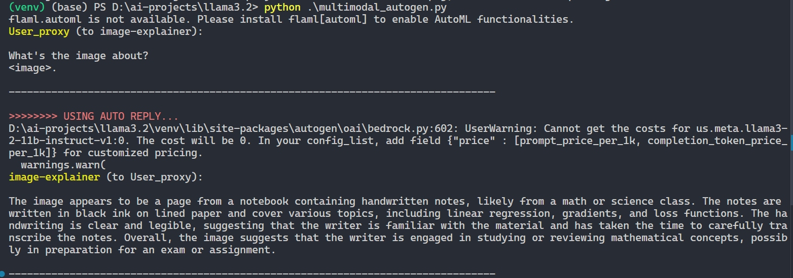

# Multimodal AI Agents with Llama 3.2 Vision Models using AWS Bedrock

This project demonstrates how to leverage Llama 3.2 vision models via AWS Bedrock to create powerful multimodal AI agents capable of processing both images and text prompts. We'll explore how to use the 11B Instruct v1 version of Llama 3.2 to handle complex tasks, showcasing the versatility of these models with real-world applications.

The primary use case demonstrated here involves building an AI agent that generates a blog post using input from both text and images, which is then saved in a markdown file. You can check out the generated blog post here: [generated blog](./blog_post.md).

## Features

- Utilizes Llama 3.2 vision models through AWS Bedrock to create multimodal AI agents using AutoGen.
- Supports both image and text inputs, allowing seamless and versatile interactions.
- Demonstrates AI-powered Optical Character Recognition (OCR) capabilities for image analysis.

## Prerequisites

1. AWS account with access to Bedrock services.
2. AWS CLI configured with your credentials.
3. Familiarity with Python and basic AI/ML concepts.

## Installation

1. Clone the repository:
   ```bash
   git clone https://github.com/Hk669/AutoGen-Llama3.2-Vision.git
   ```

2. Install the required dependencies:
   ```bash
   pip install boto3 autogen["bedrock"] "pyautogen[lmm]>=0.2.17"
   ```

3. Configure your AWS credentials:
   ```bash
   aws configure
   ```

4. Update the `.env` file with the following keys:
   - `AWS_ACCESS_KEY_ID`
   - `AWS_SECRET_ACCESS_KEY`

## Using the Llama 3.2 Vision Model with AutoGen AI Agents

The Llama 3.2 model works with both image and text inputs, enabling AI agents to perform complex tasks involving multiple data types. The following instructions detail how to use this model through AWS Bedrock:

### Step 1: Modify the Input Query and the Image

```py
user_proxy.initiate_chat(
    image_agent,
    message="""What's the image about?
.""", # update the link of the image
)
```

### Step 2: Running the Script

Run the Llama 3.2 Bedrock script:
```bash
python multimodal_autogen.py
```
This will trigger the model to analyze the input image and generate a response based on the text prompt provided.

### Example Use Case

You can create an AI agent that generates a complete blog post by analyzing both images and related prompts. The output will be saved as a markdown file (`blog_post.md`) for easy sharing and editing.

## Using AutoGen with Llama 3.2

AutoGen allows you to create intelligent agents capable of handling various multimodal tasks using Llama 3.2 models. Here's how to get started:

### Step 1: Install Dependencies
```bash
pip install autogen["bedrock"]
```

### Step 2: Set up Your Environment
Ensure your `.env` file contains your AWS credentials.

### Step 3: Run the Script
```bash
python autogen_llama3_2.py
```

The script will initiate an AI agent that processes the inputs and generates results based on your specified query. Check out the generated blog post saved in `blog_post.md`.

### Output Example

The following output example showcases the model’s ability to perform OCR-like tasks, extracting text from images:



You can also find an example of vision-based response generation using the Llama 3.2 model:



## Model Details

- **Model ID**: `us.meta.llama3-2-11b-instruct-v1:0`
- **Model Family**: Llama 3.2
- **Capabilities**: Multimodal AI, Image Analysis, Text Generation

## Important Notes

- Make sure you have the appropriate permissions and are compliant with AWS Bedrock’s terms of service.
- Image analysis accuracy might vary based on image quality and clarity.
- Be mindful of AWS Bedrock's usage costs when working with Llama models.

This project offers a comprehensive guide to building AI agents that effectively use Llama 3.2 vision models through AWS Bedrock, enabling you to unlock advanced multimodal AI capabilities.
